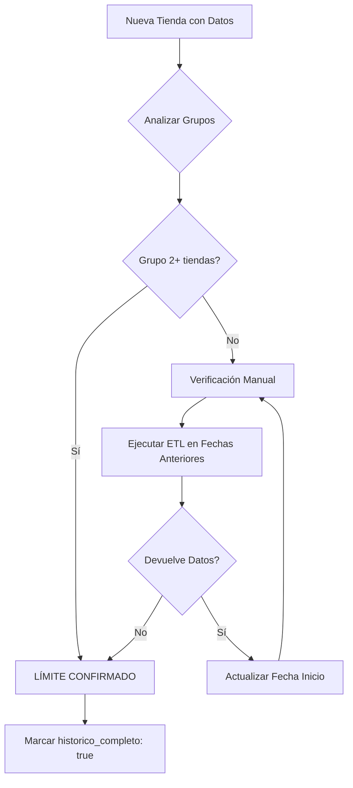

# Metodología: Identificación de Límites Históricos

## 🎯 Objetivo

Determinar cuáles tiendas ya tienen **TODO su histórico disponible** cargado en la base de datos, evitando intentos innecesarios de cargar datos que no existen.

## 📋 Problema

Solo podemos confirmar el límite histórico de una tienda cuando el ETL **NO devuelve datos** al intentar cargar fechas anteriores. Esto genera confusión:
- ¿Falta cargar histórico o simplemente no existe?
- ¿Cómo saber cuándo ya tenemos el 100%?

## ✅ Solución: Metodología de Grupos

### Principio Fundamental

**Si múltiples tiendas (2+) tienen la misma fecha de inicio, es porque ESA es la fecha más antigua disponible en el sistema origen.**

### Lógica

```
tienda_01: 2024-07-03  ┐
tienda_02: 2024-07-03  ├─ GRUPO → LÍMITE HISTÓRICO CONFIRMADO
tienda_03: 2024-07-03  │  (4 tiendas con misma fecha = no es coincidencia)
tienda_09: 2024-07-03  ┘

tienda_11: 2025-09-01  → CASO ÚNICO → Requiere verificación manual
```

## 📊 Estados de Verificación

### ✅ LÍMITE HISTÓRICO CONFIRMADO (Grupo 2+ tiendas)

| Fecha Inicio | Tiendas | Estado |
|--------------|---------|--------|
| 2024-07-03 | tienda_01, 02, 03, 09 (4) | ✅ Confirmado |
| 2025-01-02 | tienda_05, 06, 07 (3) | ✅ Confirmado |
| 2025-07-01 | tienda_08, 10, 12, 13, 15 (5) | ✅ Confirmado |

**Acción**: Marcar como `historico_completo: true` en config

### ⚠️ REQUIERE VERIFICACIÓN MANUAL (Tienda única)

| Tienda | Fecha Inicio | Método de Verificación |
|--------|--------------|----------------------|
| tienda_04 | 2024-10-01 | Ejecutar ETL en fechas anteriores |
| tienda_11 | 2025-09-01 | Ejecutar ETL en fechas anteriores |
| tienda_16 | 2025-05-01 | Ejecutar ETL en fechas anteriores |
| tienda_19 | 2025-07-30 | ✅ Verificado manualmente - NO hay datos antes |

**Acción**: Ejecutar ETL y si no devuelve datos, marcar como completo

## 🔍 Proceso de Verificación

### Para Grupos (Automático)

1. Analizar fechas de inicio en la BD
2. Agrupar tiendas por fecha de inicio
3. Si grupo tiene 2+ tiendas → **LÍMITE CONFIRMADO**
4. Actualizar config con `historico_completo: true`

### Para Casos Únicos (Manual)

```bash
# Ejemplo: Verificar tienda_04 (inicio: 2024-10-01)
python3 etl/core/etl_ventas_historico.py \
  --tiendas tienda_04 \
  --fecha-inicio 2024-09-01 \
  --fecha-fin 2024-09-30

# Si devuelve "Sin datos de ventas extraídos" → Límite confirmado
# Actualizar config:
{
  "tienda_04": {
    "historico_completo": true,
    "notas": "Verificado manualmente YYYY-MM-DD: no hay datos antes de 2024-10-01"
  }
}
```

## 📝 Configuración: config_historico_tiendas.json

### Estructura

```json
{
  "tiendas": {
    "tienda_XX": {
      "nombre": "NOMBRE TIENDA",
      "fecha_inicio_historico": "YYYY-MM-DD",
      "notas": "EXPLICACIÓN",
      "verificado": true/false,
      "historico_completo": true/false
    }
  }
}
```

### Estados

| Campo | Valores | Significado |
|-------|---------|-------------|
| `verificado` | `true` | Se confirmó la fecha (grupo o manual) |
| `verificado` | `false` | Requiere verificación |
| `historico_completo` | `true` | Tiene el 100% del histórico disponible |
| `historico_completo` | `false` | Aún falta histórico |

### Ejemplos

**Grupo Confirmado:**
```json
"tienda_01": {
  "nombre": "PERIFERICO",
  "fecha_inicio_historico": "2024-07-03",
  "notas": "LÍMITE HISTÓRICO CONFIRMADO - Grupo de 4 tiendas (01,02,03,09)",
  "verificado": true,
  "historico_completo": true
}
```

**Caso Único - No Verificado:**
```json
"tienda_04": {
  "nombre": "SAN DIEGO",
  "fecha_inicio_historico": "2024-10-01",
  "notas": "Tienda única - Requiere verificación manual",
  "verificado": false,
  "historico_completo": false
}
```

**Caso Único - Verificado Manualmente:**
```json
"tienda_19": {
  "nombre": "GUIGUE",
  "fecha_inicio_historico": "2025-07-30",
  "notas": "Verificado 2025-10-10: no hay datos antes de esta fecha",
  "verificado": true,
  "historico_completo": true
}
```

## 🚀 Herramientas

### 1. Análisis Automático de Grupos

```bash
python3 -c "
import duckdb
conn = duckdb.connect('data/fluxion_production.db', read_only=True)

query = '''
SELECT
    MIN(fecha) as fecha_inicio,
    COUNT(*) as num_tiendas,
    STRING_AGG(ubicacion_id, ', ') as tiendas
FROM (
    SELECT ubicacion_id, MIN(fecha) as fecha
    FROM ventas_raw
    WHERE ubicacion_id LIKE 'tienda_%'
    GROUP BY ubicacion_id
)
GROUP BY fecha_inicio
ORDER BY fecha_inicio
'''

print(conn.execute(query).fetchdf())
"
```

### 2. Reporte de Sincronización

```bash
python3 generar_reporte_sync.py
```

Muestra:
- ✓✓ Tiendas con histórico completo
- ⚠️ Tiendas con histórico incompleto
- Estado detallado por tienda

### 3. Verificación Manual de Límite

```bash
# Plantilla
python3 etl/core/etl_ventas_historico.py \
  --tiendas TIENDA_ID \
  --fecha-inicio FECHA_ANTERIOR_INICIO \
  --fecha-fin FECHA_ANTERIOR_FIN
```

## 📈 Workflow Completo



## 🎯 Resultado Final

### Estado Actual (2025-10-10)

**✅ Histórico Completo (13 tiendas):**
- Grupo 2024-07-03: tienda_01, 02, 03, 09
- Grupo 2025-01-02: tienda_05, 06, 07
- Grupo 2025-07-01: tienda_08, 10, 12, 13, 15
- Verificado manual: tienda_19

**⚠️ Histórico Incompleto (3 tiendas):**
- tienda_04 (2024-10-01) - Requiere verificación
- tienda_11 (2025-09-01) - Requiere verificación
- tienda_16 (2025-05-01) - Requiere verificación

### Próximos Pasos

1. **Verificar tienda_04:**
   ```bash
   python3 etl/core/etl_ventas_historico.py --tiendas tienda_04 --fecha-inicio 2024-08-01 --fecha-fin 2024-09-30
   ```

2. **Verificar tienda_11:**
   ```bash
   python3 etl/core/etl_ventas_historico.py --tiendas tienda_11 --fecha-inicio 2025-07-01 --fecha-fin 2025-08-31
   ```

3. **Verificar tienda_16:**
   ```bash
   python3 etl/core/etl_ventas_historico.py --tiendas tienda_16 --fecha-inicio 2025-03-01 --fecha-fin 2025-04-30
   ```

4. Si ETL dice "Sin datos", actualizar config con `historico_completo: true`

## 💡 Tips

- ✅ Siempre documentar en `notas` cómo se verificó
- ✅ Fecha en notas cuando se verificó manualmente
- ✅ Grupo de tiendas = evidencia fuerte de límite
- ⚠️ Tienda única = siempre verificar
- 📅 Revisar periódicamente por si se agregan datos históricos
