# FLUXION AI - DIAGRAMA DE BASE DE DATOS
## Arquitectura Multi-Tenant PostgreSQL + TimescaleDB

```mermaid
erDiagram
    %% =============================================================================
    %% SHARED SCHEMA (Cross-tenant data)
    %% =============================================================================
    
    SHARED_SYSTEM_CONFIG {
        varchar key PK
        text value
        text description
        timestamptz created_at
        timestamptz updated_at
    }
    
    SHARED_TENANTS {
        uuid id PK
        varchar slug UK "URL-friendly identifier"
        varchar name
        varchar schema_name UK "PostgreSQL schema name"
        varchar status "active|inactive|suspended"
        jsonb settings
        timestamptz created_at
        timestamptz updated_at
    }
    
    SHARED_TENANT_USERS {
        uuid id PK
        uuid tenant_id FK
        citext email UK
        varchar password_hash
        varchar full_name
        varchar role "admin|manager|user|viewer"
        boolean is_active
        timestamptz last_login_at
        timestamptz created_at
        timestamptz updated_at
    }

    %% =============================================================================
    %% TENANT SCHEMA TEMPLATE (Replicated per tenant)
    %% =============================================================================
    
    USERS {
        uuid id PK
        uuid tenant_id "Always present for RLS"
        citext email UK
        varchar password_hash
        varchar full_name
        varchar role "admin|manager|user|viewer"
        uuid_array store_ids "Stores user can access"
        jsonb permissions
        jsonb preferences
        boolean is_active
        timestamptz last_login_at
        timestamptz created_at
        timestamptz updated_at
    }
    
    STORES {
        uuid id PK
        uuid tenant_id
        varchar code UK "Store identifier"
        varchar name
        varchar type "warehouse|store|distribution_center"
        jsonb address "Street, city, state, postal_code"
        jsonb contact "Phone, email, manager"
        jsonb settings "Store-specific config"
        boolean is_active
        timestamptz created_at
        timestamptz updated_at
    }
    
    CATEGORIES {
        uuid id PK
        uuid tenant_id
        uuid parent_id FK "Self-referencing for hierarchy"
        varchar code UK
        varchar name
        text description
        jsonb settings
        boolean is_active
        timestamptz created_at
        timestamptz updated_at
    }
    
    SUPPLIERS {
        uuid id PK
        uuid tenant_id
        varchar code UK
        varchar business_name
        varchar trade_name
        varchar tax_id "RIF in Venezuela"
        varchar contact_person
        varchar phone
        citext email
        jsonb address
        varchar payment_terms
        decimal credit_limit
        jsonb settings
        boolean is_active
        timestamptz created_at
        timestamptz updated_at
    }
    
    PRODUCTS {
        uuid id PK
        uuid tenant_id
        varchar sku UK "Stock Keeping Unit"
        varchar barcode
        varchar name
        text description
        uuid category_id FK
        uuid supplier_id FK
        varchar unit_type "unit|kg|liter|meter|box|case"
        integer min_stock_level
        integer max_stock_level
        integer reorder_point
        decimal cost_price
        decimal selling_price
        decimal tax_rate "16% IVA Venezuela"
        jsonb settings "Custom fields, AI thresholds"
        boolean is_active
        timestamptz created_at
        timestamptz updated_at
    }
    
    INVENTORY {
        uuid id PK
        uuid tenant_id
        uuid product_id FK
        uuid store_id FK
        integer quantity_on_hand
        integer quantity_reserved
        integer quantity_available "GENERATED ALWAYS AS (quantity_on_hand - quantity_reserved)"
        timestamptz last_movement_at
        decimal cost_per_unit
        timestamptz created_at
        timestamptz updated_at
    }
    
    %% TimescaleDB Hypertable
    INVENTORY_MOVEMENTS {
        uuid id PK
        uuid tenant_id
        uuid product_id FK
        uuid store_id FK
        varchar movement_type "in|out|transfer|adjustment"
        varchar reference_type "purchase|sale|transfer|adjustment"
        uuid reference_id "Source transaction ID"
        integer quantity
        decimal cost_per_unit
        decimal total_cost "GENERATED ALWAYS AS (quantity * cost_per_unit)"
        text notes
        uuid created_by FK "References users(id)"
        timestamptz created_at "HYPERTABLE PARTITION KEY"
    }
    
    SALES {
        uuid id PK
        uuid tenant_id
        uuid store_id FK
        varchar invoice_number UK
        uuid client_id "Optional business client"
        varchar client_name "Walk-in customer name"
        varchar client_tax_id "RIF for business customers"
        decimal subtotal
        decimal tax_amount
        decimal total_amount
        varchar payment_method "cash|card|transfer|check|credit"
        varchar payment_status "paid|pending|partial|cancelled"
        text notes
        varchar pos_transaction_id "External POS reference"
        uuid created_by FK
        timestamptz created_at
        timestamptz updated_at
    }
    
    SALE_ITEMS {
        uuid id PK
        uuid tenant_id
        uuid sale_id FK
        uuid product_id FK
        integer quantity
        decimal unit_price
        decimal line_total "GENERATED ALWAYS AS (quantity * unit_price)"
        timestamptz created_at
    }
    
    PURCHASE_ORDERS {
        uuid id PK
        uuid tenant_id
        uuid store_id FK
        uuid supplier_id FK
        varchar order_number UK
        varchar status "draft|sent|confirmed|partial|received|cancelled"
        date order_date
        date expected_date
        date received_date
        decimal subtotal
        decimal tax_amount
        decimal total_amount
        text notes
        uuid created_by FK
        timestamptz created_at
        timestamptz updated_at
    }
    
    PURCHASE_ORDER_ITEMS {
        uuid id PK
        uuid tenant_id
        uuid purchase_order_id FK
        uuid product_id FK
        integer quantity_ordered
        integer quantity_received
        decimal unit_cost
        decimal line_total "GENERATED ALWAYS AS (quantity_ordered * unit_cost)"
        timestamptz created_at
        timestamptz updated_at
    }
    
    ALERTS {
        uuid id PK
        uuid tenant_id
        varchar alert_type "low_stock|overstock|demand_spike|slow_moving|forecast_alert"
        varchar priority "low|medium|high|critical"
        varchar title
        text description
        uuid product_id FK "Optional"
        uuid store_id FK "Optional"
        uuid category_id FK "Optional"
        jsonb data "Alert-specific data (thresholds, predictions)"
        varchar status "active|acknowledged|resolved|dismissed"
        uuid acknowledged_by FK
        timestamptz acknowledged_at
        timestamptz resolved_at
        varchar generated_by "AI agent name"
        timestamptz created_at
        timestamptz updated_at
    }
    
    %% TimescaleDB Hypertable
    FORECASTS {
        uuid id PK
        uuid tenant_id
        uuid product_id FK
        uuid store_id FK
        varchar forecast_type "demand|reorder|seasonality|trend"
        varchar period_type "daily|weekly|monthly"
        date forecast_date "HYPERTABLE PARTITION KEY"
        decimal predicted_value
        decimal confidence_level "0-100 percentage"
        varchar model_version
        jsonb metadata
        timestamptz created_at
    }
    
    %% TimescaleDB Hypertable - Audit Trail
    EVENTS {
        uuid id PK
        uuid tenant_id
        varchar event_type "inventory_updated|sale_created|alert_generated"
        varchar entity_type "product|sale|inventory|alert"
        uuid entity_id
        uuid user_id FK
        varchar action "created|updated|deleted"
        jsonb old_data "Previous state"
        jsonb new_data "New state"
        jsonb metadata
        inet ip_address
        text user_agent
        timestamptz created_at "HYPERTABLE PARTITION KEY"
    }

    %% =============================================================================
    %% RELATIONSHIPS
    %% =============================================================================
    
    %% Shared Schema Relationships
    SHARED_TENANT_USERS }|--|| SHARED_TENANTS : belongs_to
    
    %% Tenant Schema Relationships
    USERS }|--|| STORES : can_access
    
    CATEGORIES ||--o{ CATEGORIES : parent_child
    PRODUCTS }|--|| CATEGORIES : belongs_to
    PRODUCTS }|--|| SUPPLIERS : supplied_by
    
    INVENTORY }|--|| PRODUCTS : tracks
    INVENTORY }|--|| STORES : located_in
    
    INVENTORY_MOVEMENTS }|--|| PRODUCTS : affects
    INVENTORY_MOVEMENTS }|--|| STORES : occurs_in
    INVENTORY_MOVEMENTS }|--|| USERS : created_by
    
    SALES }|--|| STORES : sold_from
    SALES }|--|| USERS : created_by
    SALE_ITEMS }|--|| SALES : part_of
    SALE_ITEMS }|--|| PRODUCTS : contains
    
    PURCHASE_ORDERS }|--|| STORES : delivered_to
    PURCHASE_ORDERS }|--|| SUPPLIERS : ordered_from
    PURCHASE_ORDERS }|--|| USERS : created_by
    PURCHASE_ORDER_ITEMS }|--|| PURCHASE_ORDERS : part_of
    PURCHASE_ORDER_ITEMS }|--|| PRODUCTS : contains
    
    ALERTS }|--o| PRODUCTS : relates_to
    ALERTS }|--o| STORES : affects
    ALERTS }|--o| CATEGORIES : concerns
    ALERTS }|--o| USERS : acknowledged_by
    
    FORECASTS }|--|| PRODUCTS : predicts
    FORECASTS }|--|| STORES : for_location
    
    EVENTS }|--o| USERS : triggered_by
```



## ARQUITECTURA MULTI-TENANT DETALLADA

### 🏗️ ESTRUCTURA DE SCHEMAS

```
fluxion_dev/
├── shared/                    # Cross-tenant data
│   ├── system_config         # Global configuration
│   ├── tenants              # Tenant registry
│   └── tenant_users         # Cross-tenant user access
│
├── template/                 # Template for new tenants
│   ├── users                # Per-tenant users
│   ├── stores               # Warehouses/stores
│   ├── categories           # Product categories
│   ├── suppliers            # Supplier management
│   ├── products             # Product catalog
│   ├── inventory            # Current stock levels
│   ├── inventory_movements  # Stock movements (TimescaleDB)
│   ├── sales                # Sales transactions
│   ├── sale_items          # Sales line items
│   ├── purchase_orders     # Purchase management
│   ├── purchase_order_items # Purchase line items
│   ├── alerts              # AI-generated alerts
│   ├── forecasts           # ML predictions (TimescaleDB)
│   └── events              # Audit trail (TimescaleDB)
│
└── tenant_fluxion_demo/      # Actual tenant schema
    ├── (same tables as template)
    └── ...
```

### 📊 TIMESCALEDB HYPERTABLES

Las siguientes tablas están optimizadas para series temporales:

1. **`inventory_movements`** - Particionada por `created_at`
   - Movimientos de inventario históricos
   - Permite análisis de tendencias temporales
   - Compresión automática de datos antiguos

2. **`forecasts`** - Particionada por `forecast_date`
   - Predicciones de IA organizadas por fecha
   - Queries eficientes para rangos temporales
   - Retención automática de predicciones antiguas

3. **`events`** - Particionada por `created_at`
   - Audit trail completo del sistema
   - Trazabilidad de cambios en el tiempo
   - Análisis de patrones de uso

### 🔐 ROW LEVEL SECURITY (RLS)

Cada tabla tiene políticas RLS que verifican:
```sql
-- Ejemplo de política RLS
CREATE POLICY tenant_isolation_policy ON template.products 
USING (tenant_id = current_setting('app.current_tenant_id')::UUID);
```

### 📈 ÍNDICES OPTIMIZADOS

```sql
-- Inventario
CREATE INDEX idx_inventory_low_stock ON template.inventory(tenant_id, quantity_available) 
WHERE quantity_available < 10;

-- Búsquedas de productos
CREATE INDEX idx_products_tenant_sku ON template.products(tenant_id, sku);

-- Consultas temporales
CREATE INDEX idx_movements_time_product ON template.inventory_movements(created_at, product_id);
```

### 🔄 TRIGGERS AUTOMÁTICOS

1. **`update_updated_at_trigger`** - Actualiza `updated_at` automáticamente
2. **`inventory_movement_trigger`** - Actualiza stock en `inventory` después de movimientos
3. **`low_stock_alert_trigger`** - Genera alertas cuando stock < reorder_point

### 💾 DATOS VENEZOLANOS EJEMPLO

```sql
-- Tenant Demo
INSERT INTO shared.tenants VALUES (
  'fluxion-demo', 'Fluxion Demo Company', 'tenant_fluxion_demo'
);

-- Productos Venezolanos
INSERT INTO tenant_fluxion_demo.products VALUES (
  'LAC001', '7591234567890', 'Leche Entera Santa Bárbara 1L',
  'Leche entera pasteurizada', 'LACTEOS', 'POLAR',
  2.50, 3.25, 16.00  -- Costo, Venta, IVA
);

-- Proveedores Venezolanos  
INSERT INTO tenant_fluxion_demo.suppliers VALUES (
  'POLAR', 'Empresas Polar, S.A.', 'J-30105123-4',
  'Ana Jiménez', '+58-212-2024000'
);
```

### ⚡ PERFORMANCE OPTIMIZATIONS

1. **Particionamiento Temporal** - TimescaleDB automáticamente particiona por tiempo
2. **Índices Compuestos** - Optimizados para queries multi-tenant
3. **Compresión** - Datos antiguos comprimidos automáticamente
4. **Connection Pooling** - Pool de conexiones configurado para alta concurrencia

### 🔍 QUERIES TÍPICOS

```sql
-- Stock bajo por tienda
SELECT p.name, i.quantity_available, p.reorder_point
FROM tenant_demo.inventory i
JOIN tenant_demo.products p ON i.product_id = p.id
WHERE i.tenant_id = 'demo-tenant-id' 
  AND i.quantity_available < p.reorder_point;

-- Movimientos de inventario últimos 30 días
SELECT * FROM tenant_demo.inventory_movements
WHERE tenant_id = 'demo-tenant-id'
  AND created_at >= NOW() - INTERVAL '30 days';

-- Predicciones futuras para un producto
SELECT * FROM tenant_demo.forecasts
WHERE tenant_id = 'demo-tenant-id'
  AND product_id = 'product-uuid'
  AND forecast_date >= CURRENT_DATE;
```

¿Te gustaría que profundice en algún aspecto específico de la base de datos? Por ejemplo:
- Estrategias de backup y recuperación
- Performance tuning específico
- Ejemplos de queries complejos para reportes
- Migración de datos entre tenants