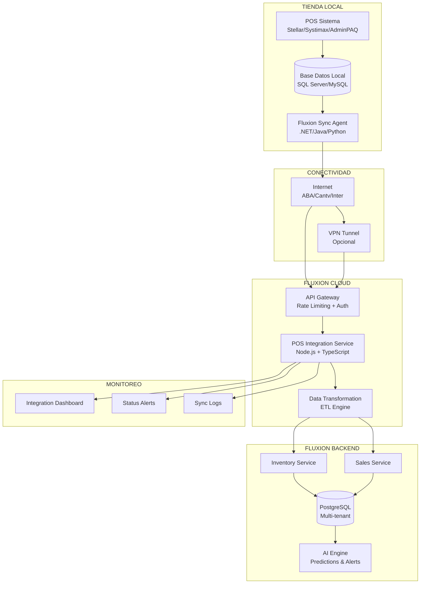

# FLUXION AI - ESTRATEGIA DE INTEGRACIÓN POS
## Sistemas POS Venezolanos: Arquitectura y Implementación

## 🇻🇪 LANDSCAPE DE POS EN VENEZUELA

### **SISTEMAS MÁS COMUNES**

1. **Stellar POS** (SQL Server)
   - Penetración: ~40% mercado mayorista
   - Base de datos: SQL Server 2012-2019
   - Arquitectura: Cliente-servidor local
   - Fortalezas: Robusto, completo, soporte local

2. **Systimax/Abacus** (Oracle/MySQL)
   - Penetración: ~25% mercado retail
   - Base de datos: Oracle/MySQL
   - Arquitectura: Híbrida local/cloud
   - Fortalezas: Escalable, multi-tienda

3. **AdminPAQ/ContPAQ** (SQL Server)
   - Penetración: ~20% PyMEs
   - Base de datos: SQL Server Express
   - Arquitectura: Local/LAN
   - Fortalezas: Económico, fácil uso

4. **Sistemas Legacy/Propios** (Varios)
   - Penetración: ~15% restante
   - Base de datos: FoxPro, Access, PostgreSQL
   - Arquitectura: Muy variable
   - Desafíos: Integración compleja

## 🏗️ ARQUITECTURA DE INTEGRACIÓN



## 🔌 MÉTODOS DE INTEGRACIÓN

### **1. DIRECT DATABASE CONNECTION**

#### **Stellar POS (SQL Server)**
```sql
-- Conexión directa a base Stellar
EXEC sp_configure 'show advanced options', 1;
RECONFIGURE;
EXEC sp_configure 'Ad Hoc Distributed Queries', 1;
RECONFIGURE;

-- Query productos desde Stellar
SELECT 
    p.codigo as sku,
    p.nombre as name,
    p.precio_venta as selling_price,
    p.existencia as stock,
    p.fecha_ultima_venta as last_sale_date,
    c.nombre as category_name
FROM stellar_db.dbo.productos p
LEFT JOIN stellar_db.dbo.categorias c ON p.categoria_id = c.id
WHERE p.activo = 1;

-- Query ventas del día
SELECT 
    v.numero_factura as invoice_number,
    v.fecha_venta as sale_date,
    v.subtotal,
    v.iva,
    v.total,
    v.forma_pago as payment_method,
    dv.codigo_producto as product_sku,
    dv.cantidad as quantity,
    dv.precio_unitario as unit_price
FROM stellar_db.dbo.ventas v
INNER JOIN stellar_db.dbo.detalle_ventas dv ON v.id = dv.venta_id
WHERE CAST(v.fecha_venta AS DATE) = CAST(GETDATE() AS DATE);
```

#### **Systimax (MySQL/Oracle)**
```sql
-- MySQL connection para Systimax
SELECT 
    p.item_code as sku,
    p.item_name as name,
    p.sale_price as selling_price,
    s.qty_on_hand as stock,
    p.last_sale_date,
    c.category_name
FROM items p
LEFT JOIN stock s ON p.item_id = s.item_id
LEFT JOIN categories c ON p.category_id = c.category_id
WHERE p.active = 'Y'
  AND s.location_id = ?; -- Store location

-- Sales data
SELECT 
    t.trans_no as invoice_number,
    t.trans_date as sale_date,
    t.subtotal,
    t.tax_amount as iva,
    t.total_amount as total,
    t.payment_type as payment_method,
    td.item_code as product_sku,
    td.qty as quantity,
    td.unit_price
FROM transactions t
INNER JOIN transaction_details td ON t.trans_id = td.trans_id
WHERE DATE(t.trans_date) = CURDATE();
```

### **2. FILE-BASED SYNC**

#### **Export/Import via CSV/XML**
```typescript
// Fluxion Sync Agent - File Processor
interface StellarExportFormat {
  productos: {
    codigo: string;
    nombre: string;
    precio_venta: number;
    existencia: number;
    categoria: string;
    proveedor: string;
    fecha_actualizacion: string;
  }[];
  ventas: {
    factura: string;
    fecha: string;
    cliente: string;
    subtotal: number;
    iva: number;
    total: number;
    items: {
      codigo: string;
      cantidad: number;
      precio: number;
    }[];
  }[];
}

class StellarFileProcessor {
  async processExportedData(filePath: string): Promise<void> {
    const data = await this.readCSVFile(filePath);
    const transformedData = await this.transformToFluxionFormat(data);
    await this.syncToFluxion(transformedData);
  }

  private async transformToFluxionFormat(stellarData: any): Promise<FluxionSyncData> {
    return {
      products: stellarData.productos.map(p => ({
        sku: p.codigo,
        name: p.nombre,
        sellingPrice: p.precio_venta,
        stock: p.existencia,
        category: p.categoria,
        supplier: p.proveedor,
        lastUpdated: new Date(p.fecha_actualizacion)
      })),
      sales: stellarData.ventas.map(v => ({
        invoiceNumber: v.factura,
        date: new Date(v.fecha),
        subtotal: v.subtotal,
        tax: v.iva,
        total: v.total,
        items: v.items.map(item => ({
          sku: item.codigo,
          quantity: item.cantidad,
          unitPrice: item.precio
        }))
      }))
    };
  }
}
```

### **3. API INTEGRATION**

#### **Modern POS with REST APIs**
```typescript
// POS API Client
interface POSAPIClient {
  getProducts(storeId: string): Promise<Product[]>;
  getSales(storeId: string, date: Date): Promise<Sale[]>;
  updateStock(storeId: string, updates: StockUpdate[]): Promise<void>;
}

class SystimaxAPIClient implements POSAPIClient {
  constructor(
    private baseUrl: string,
    private apiKey: string,
    private storeId: string
  ) {}

  async getProducts(): Promise<Product[]> {
    const response = await fetch(`${this.baseUrl}/api/items`, {
      headers: {
        'Authorization': `Bearer ${this.apiKey}`,
        'Store-ID': this.storeId
      }
    });
    
    const data = await response.json();
    return data.items.map(this.transformProduct);
  }

  async getSales(date: Date): Promise<Sale[]> {
    const dateStr = date.toISOString().split('T')[0];
    const response = await fetch(`${this.baseUrl}/api/sales?date=${dateStr}`, {
      headers: {
        'Authorization': `Bearer ${this.apiKey}`,
        'Store-ID': this.storeId
      }
    });
    
    return await response.json();
  }
}
```

### **4. WEBHOOK/EVENT-DRIVEN SYNC**

```typescript
// POS Webhook Handler
class POSWebhookHandler {
  @Post('/webhook/stellar-pos')
  async handleStellarWebhook(@Body() payload: StellarWebhookPayload) {
    switch (payload.event_type) {
      case 'sale_completed':
        await this.processSaleEvent(payload.data);
        break;
      case 'product_updated':
        await this.processProductUpdate(payload.data);
        break;
      case 'stock_movement':
        await this.processStockMovement(payload.data);
        break;
    }
  }

  private async processSaleEvent(saleData: any) {
    // Transform and sync sale to Fluxion
    const fluxionSale = await this.transformSale(saleData);
    await this.salesService.createSale(fluxionSale);
    
    // Trigger inventory update
    await this.inventoryService.updateStock(fluxionSale.items);
    
    // Publish event for AI processing
    await this.eventService.publish('sale_created', {
      tenantId: saleData.tenant_id,
      storeId: saleData.store_id,
      sale: fluxionSale
    });
  }
}
```

## 🔄 DATA TRANSFORMATION ENGINE

```typescript
// Universal POS Data Transformer
interface POSSystemConfig {
  type: 'stellar' | 'systimax' | 'adminpaq' | 'custom';
  connection: DatabaseConfig | APIConfig | FileConfig;
  mappings: FieldMappings;
  transformRules: TransformRule[];
}

class POSDataTransformer {
  constructor(private config: POSSystemConfig) {}

  async transformProducts(rawData: any[]): Promise<Product[]> {
    return rawData.map(item => {
      const product: Product = {
        tenantId: this.getTenantId(),
        sku: this.applyMapping('product.sku', item),
        name: this.applyMapping('product.name', item),
        barcode: this.applyMapping('product.barcode', item),
        categoryId: this.resolveCategoryId(item),
        supplierId: this.resolveSupplierId(item),
        costPrice: this.parsePrice(this.applyMapping('product.cost_price', item)),
        sellingPrice: this.parsePrice(this.applyMapping('product.selling_price', item)),
        taxRate: this.calculateTaxRate(item),
        isActive: this.parseBoolean(this.applyMapping('product.active', item))
      };

      return this.applyBusinessRules(product);
    });
  }

  private applyBusinessRules(product: Product): Product {
    // Venezuelan business rules
    if (!product.taxRate) {
      product.taxRate = 16.00; // Default IVA
    }

    // Price validation
    if (product.sellingPrice && product.costPrice) {
      const margin = ((product.sellingPrice - product.costPrice) / product.costPrice) * 100;
      if (margin < 5) {
        // Log warning for low margin
        this.logger.warn('Low margin product detected', { 
          sku: product.sku, 
          margin 
        });
      }
    }

    return product;
  }
}
```

## 📊 DATABASE INTEGRATION LAYER

```sql
-- POS Integration Tables
CREATE SCHEMA IF NOT EXISTS pos_integration;

-- POS Systems Registry
CREATE TABLE pos_integration.pos_systems (
    id UUID PRIMARY KEY DEFAULT uuid_generate_v4(),
    tenant_id UUID NOT NULL,
    system_type VARCHAR(50) NOT NULL, -- stellar, systimax, adminpaq
    system_name VARCHAR(200) NOT NULL,
    connection_config JSONB NOT NULL,
    field_mappings JSONB NOT NULL,
    sync_settings JSONB DEFAULT '{}',
    is_active BOOLEAN DEFAULT true,
    last_sync_at TIMESTAMPTZ,
    created_at TIMESTAMPTZ DEFAULT NOW(),
    updated_at TIMESTAMPTZ DEFAULT NOW()
);

-- Sync Status Tracking
CREATE TABLE pos_integration.sync_jobs (
    id UUID PRIMARY KEY DEFAULT uuid_generate_v4(),
    pos_system_id UUID REFERENCES pos_integration.pos_systems(id),
    job_type VARCHAR(50) NOT NULL, -- full_sync, incremental, real_time
    status VARCHAR(20) DEFAULT 'pending', -- pending, running, completed, failed
    started_at TIMESTAMPTZ DEFAULT NOW(),
    completed_at TIMESTAMPTZ,
    records_processed INTEGER DEFAULT 0,
    records_failed INTEGER DEFAULT 0,
    error_details JSONB,
    sync_summary JSONB
);

-- Data Mapping Cache
CREATE TABLE pos_integration.mapping_cache (
    id UUID PRIMARY KEY DEFAULT uuid_generate_v4(),
    pos_system_id UUID REFERENCES pos_integration.pos_systems(id),
    external_id VARCHAR(100) NOT NULL,
    external_table VARCHAR(50) NOT NULL,
    fluxion_entity VARCHAR(50) NOT NULL,
    fluxion_id UUID NOT NULL,
    mapping_data JSONB,
    created_at TIMESTAMPTZ DEFAULT NOW(),
    updated_at TIMESTAMPTZ DEFAULT NOW(),
    
    UNIQUE(pos_system_id, external_id, external_table)
);

-- Sync Conflicts Resolution
CREATE TABLE pos_integration.sync_conflicts (
    id UUID PRIMARY KEY DEFAULT uuid_generate_v4(),
    pos_system_id UUID REFERENCES pos_integration.pos_systems(id),
    entity_type VARCHAR(50) NOT NULL,
    entity_id UUID NOT NULL,
    conflict_type VARCHAR(50) NOT NULL, -- price_mismatch, quantity_diff, duplicate_sku
    pos_data JSONB NOT NULL,
    fluxion_data JSONB NOT NULL,
    resolution_strategy VARCHAR(50), -- pos_wins, fluxion_wins, manual, average
    resolved_at TIMESTAMPTZ,
    resolved_by UUID,
    resolution_notes TEXT,
    created_at TIMESTAMPTZ DEFAULT NOW()
);
```

## ⚡ SYNC STRATEGIES

### **1. REAL-TIME SYNC (Ideal)**
```typescript
// Event-driven real-time synchronization
class RealTimePOSSync {
  async setupTriggers(posSystemId: string) {
    // SQL Server triggers for Stellar
    await this.createSQLServerTrigger(posSystemId, 'productos', 'INSERT,UPDATE,DELETE');
    await this.createSQLServerTrigger(posSystemId, 'ventas', 'INSERT');
    await this.createSQLServerTrigger(posSystemId, 'detalle_ventas', 'INSERT');
  }

  private async createSQLServerTrigger(systemId: string, table: string, events: string) {
    const triggerSQL = `
      CREATE TRIGGER fluxion_sync_${table}_trigger
      ON ${table}
      AFTER ${events}
      AS
      BEGIN
        DECLARE @json NVARCHAR(MAX)
        SELECT @json = (
          SELECT * FROM inserted FOR JSON AUTO
        )
        
        EXEC xp_cmdshell 'curl -X POST http://fluxion-api/webhook/pos-event -H "Content-Type: application/json" -d @json'
      END
    `;
    
    await this.executePOSQuery(systemId, triggerSQL);
  }
}
```

### **2. SCHEDULED SYNC (Más común)**
```typescript
// Cron-based scheduled synchronization
@Cron('0 */5 * * * *') // Every 5 minutes
async scheduledSync() {
  const activePOSSystems = await this.getPOSSystems({ active: true });
  
  for (const posSystem of activePOSSystems) {
    try {
      await this.performIncrementalSync(posSystem);
    } catch (error) {
      await this.handleSyncError(posSystem, error);
    }
  }
}

private async performIncrementalSync(posSystem: POSSystem) {
  const lastSync = posSystem.lastSyncAt || new Date(0);
  
  // Sync products modified since last sync
  const modifiedProducts = await this.getModifiedProducts(posSystem, lastSync);
  await this.syncProducts(posSystem.tenantId, modifiedProducts);
  
  // Sync sales from today
  const todaySales = await this.getTodaySales(posSystem);
  await this.syncSales(posSystem.tenantId, todaySales);
  
  // Update last sync timestamp
  await this.updateLastSync(posSystem.id);
}
```

### **3. BATCH SYNC (Para sistemas legacy)**
```typescript
// File-based batch synchronization
class BatchPOSSync {
  @Cron('0 0 2 * * *') // Daily at 2 AM
  async dailyBatchSync() {
    const batchSystems = await this.getBatchPOSSystems();
    
    for (const system of batchSystems) {
      await this.processBatchFiles(system);
    }
  }

  private async processBatchFiles(system: POSSystem) {
    const exportPath = system.connectionConfig.exportPath;
    const files = await this.scanForNewFiles(exportPath);
    
    for (const file of files) {
      try {
        const data = await this.parseExportFile(file);
        const transformed = await this.transformData(system, data);
        await this.importToFluxion(system.tenantId, transformed);
        
        // Archive processed file
        await this.archiveFile(file);
      } catch (error) {
        await this.quarantineFile(file, error);
      }
    }
  }
}
```

## 🚨 ERROR HANDLING & MONITORING

```typescript
// Comprehensive error handling
class POSSyncErrorHandler {
  async handleSyncError(posSystem: POSSystem, error: Error) {
    const errorType = this.classifyError(error);
    
    switch (errorType) {
      case 'CONNECTION_ERROR':
        await this.handleConnectionError(posSystem, error);
        break;
      case 'DATA_VALIDATION_ERROR':
        await this.handleValidationError(posSystem, error);
        break;
      case 'MAPPING_ERROR':
        await this.handleMappingError(posSystem, error);
        break;
      case 'BUSINESS_RULE_ERROR':
        await this.handleBusinessRuleError(posSystem, error);
        break;
    }
  }

  private async handleConnectionError(posSystem: POSSystem, error: Error) {
    // Retry with exponential backoff
    const retryCount = await this.getRetryCount(posSystem.id);
    const backoffDelay = Math.pow(2, retryCount) * 1000; // 1s, 2s, 4s, 8s...
    
    if (retryCount < 5) {
      setTimeout(() => {
        this.retrySync(posSystem);
      }, backoffDelay);
    } else {
      // Alert administrators
      await this.sendAlert('POS_CONNECTION_FAILURE', {
        posSystem: posSystem.systemName,
        tenant: posSystem.tenantId,
        error: error.message
      });
      
      // Disable system temporarily
      await this.disableTemporarily(posSystem.id, '1 hour');
    }
  }
}
```

## 📈 INTEGRATION DASHBOARD

```typescript
// Real-time integration monitoring
interface IntegrationMetrics {
  posSystemsActive: number;
  syncJobsToday: number;
  syncSuccessRate: number;
  avgSyncDuration: number;
  conflictsUnresolved: number;
  lastSyncBySystem: Record<string, Date>;
  dataVolumeToday: {
    products: number;
    sales: number;
    movements: number;
  };
}

class IntegrationDashboard {
  async getMetrics(tenantId: string): Promise<IntegrationMetrics> {
    const [
      activeSystems,
      todayJobs,
      successRate,
      avgDuration,
      conflicts,
      lastSyncs,
      dataVolume
    ] = await Promise.all([
      this.countActivePOSSystems(tenantId),
      this.countTodaySyncJobs(tenantId),
      this.calculateSuccessRate(tenantId),
      this.calculateAvgDuration(tenantId),
      this.countUnresolvedConflicts(tenantId),
      this.getLastSyncTimes(tenantId),
      this.getTodayDataVolume(tenantId)
    ]);

    return {
      posSystemsActive: activeSystems,
      syncJobsToday: todayJobs,
      syncSuccessRate: successRate,
      avgSyncDuration: avgDuration,
      conflictsUnresolved: conflicts,
      lastSyncBySystem: lastSyncs,
      dataVolumeToday: dataVolume
    };
  }
}
```

## 💡 RECOMENDACIONES DE IMPLEMENTACIÓN

### **FASE 1: MVP (2-3 semanas)**
- Integración directa con Stellar POS (más común)
- Sync programado cada 15 minutos
- Dashboard básico de monitoreo

### **FASE 2: Expansión (4-6 semanas)**
- Soporte para Systimax y AdminPAQ
- Sync en tiempo real con webhooks
- Resolución automática de conflictos

### **FASE 3: Optimización (2-3 semanas)**
- Sync inteligente basado en cambios
- Predicción de errores con IA
- API unificada para POS partners

¿Te gustaría que profundice en algún aspecto específico como la implementación del sync agent, las estrategias de resolución de conflictos, o los detalles técnicos para un POS específico?