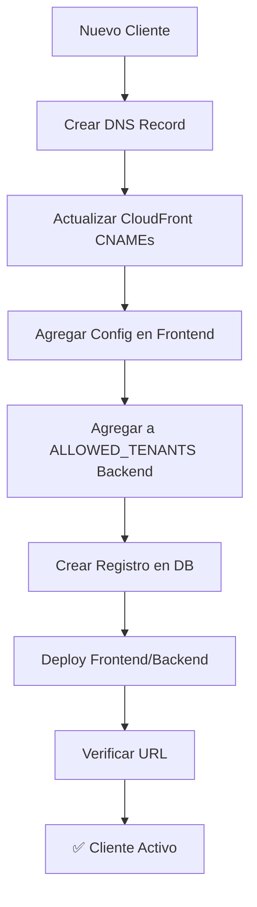

# Estrategia de Dominios - Resumen Ejecutivo

## Decisión: fluxionia.co

### Estructura de Subdominios Multi-Tenant

```
fluxionia.co                    → Landing page del producto
www.fluxionia.co                → Redirect a fluxionia.co
api.fluxionia.co                → Backend API (FastAPI)

🏢 CLIENTES (Multi-Tenant):
granja.fluxionia.co             → La Granja Mercado (Cliente actual)
cliente2.fluxionia.co           → Futuro cliente 2
cliente3.fluxionia.co           → Futuro cliente 3
[...]                           → Ilimitados clientes más

🔧 ADMIN:
admin.fluxionia.co              → Super admin panel (gestión multi-tenant)
```

## Arquitectura Simplificada

```
USUARIO → granja.fluxionia.co → CloudFront → S3 (Frontend)
                                             ↓
                                    Detecta: tenant_id = "granja"
                                             ↓
                                    Frontend carga config de "granja"
                                             ↓
                                    API calls a api.fluxionia.co
                                             ↓
                                    Backend extrae tenant_id
                                             ↓
                                    Query DB con filtro: WHERE tenant_id = 'granja'
```

## Ventajas del Modelo

### 1. Económico 💰
- **1 dominio** ($20-30/año) para TODOS los clientes
- **1 certificado SSL** wildcard GRATIS
- **1 CloudFront** distribution compartida
- **1 Hosted Zone** en Route 53
- **Total DNS/CDN**: ~$4-6/mes (vs ~$20/mes por cliente)

### 2. Escalable 📈
- Agregar nuevo cliente: **~25 minutos**
- Costo adicional por cliente: **$0** en DNS/SSL
- Subdominios ilimitados con wildcard certificate

### 3. Profesional 🎯
- Cada cliente tiene su dominio único: `cliente.fluxionia.co`
- Branding personalizado (logo, colores)
- Features personalizables por tenant

### 4. Seguro 🔒
- Aislamiento de datos por `tenant_id`
- Queries siempre filtradas por tenant
- No hay acceso cross-tenant

## Comparación con Alternativas

### Opción A: Subdominios por cliente (ELEGIDA) ✅

```
granja.fluxionia.co
cliente2.fluxionia.co
```

**Pros:**
- ✅ Muy económico (1 dominio para todos)
- ✅ Profesional (cada cliente tiene su URL)
- ✅ Fácil de escalar (wildcard SSL)
- ✅ Simple de implementar

**Contras:**
- ⚠️ Todos comparten el mismo dominio base

### Opción B: Path-based routing ❌

```
fluxionia.co/granja
fluxionia.co/cliente2
```

**Pros:**
- ✅ Muy simple

**Contras:**
- ❌ No profesional
- ❌ SEO problemático
- ❌ No permite branding por cliente
- ❌ URLs feas

### Opción C: Dominio custom por cliente ❌

```
lagranja.com
cliente2.com
```

**Pros:**
- ✅ Máximo branding

**Contras:**
- ❌ MUY caro ($20-100/año por cliente)
- ❌ Complejo de gestionar (múltiples DNS zones)
- ❌ Requiere múltiples certificados SSL
- ❌ No escala

## Flujo de Onboarding de Nuevo Cliente



**Tiempo total**: ~25 minutos

## Implementación Técnica

### Frontend (React)

```typescript
// Auto-detecta el tenant desde el hostname
const tenantId = getTenantId(); // "granja" desde granja.fluxionia.co

// Carga configuración del tenant
const config = getTenantConfig(tenantId);
// { name: "La Granja Mercado", logo: "/logos/granja.png", primaryColor: "#10b981" }

// Renderiza app con branding del tenant
<App tenantId={tenantId} config={config} />
```

### Backend (FastAPI)

```python
# Middleware extrae tenant desde hostname
@app.middleware("http")
async def extract_tenant(request: Request, call_next):
    host = request.headers.get("host")
    match = re.match(r"^([a-z0-9-]+)\.fluxionia\.co", host)
    if match:
        request.state.tenant_id = match.group(1)
    response = await call_next(request)
    return response

# Endpoints usan tenant automáticamente
@app.get("/api/v1/inventory")
async def get_inventory(request: Request):
    tenant_id = request.state.tenant_id
    return db.query(f"SELECT * FROM inventory WHERE tenant_id = '{tenant_id}'")
```

### Database (DuckDB)

```sql
-- Todas las tablas tienen tenant_id
CREATE TABLE inventory (
    id UUID PRIMARY KEY,
    tenant_id VARCHAR(50) NOT NULL,  -- 'granja', 'cliente2', etc.
    product_id VARCHAR(50),
    quantity INTEGER,
    -- ...
    CONSTRAINT unique_tenant_product UNIQUE (tenant_id, product_id)
);

CREATE INDEX idx_inventory_tenant ON inventory(tenant_id);
```

## Costos Proyectados

### Actual (1 cliente - La Granja)
- Dominio: $2.50/mes
- Route 53: $0.50/mes
- CloudFront: $3-5/mes
- Backend (ECS): $30-40/mes
- **Total**: ~$40-50/mes

### Con 10 clientes
- Dominio: $2.50/mes (mismo)
- Route 53: $0.50/mes (mismo)
- CloudFront: $8-12/mes (shared, pequeño aumento)
- Backend (ECS): $40-60/mes (scaled, aún compartido)
- **Total**: ~$55-75/mes
- **Costo por cliente**: ~$5.50-7.50/mes 🎉

### Con 100 clientes (futuro)
- Infraestructura compartida: ~$100-150/mes
- **Costo por cliente**: ~$1-1.50/mes 🚀

## Checklist de Implementación

- [ ] Comprar dominio `fluxionia.co` en Cloudflare
- [ ] Crear Hosted Zone en Route 53
- [ ] Delegar nameservers de Cloudflare a AWS
- [ ] Solicitar certificado wildcard `*.fluxionia.co` en ACM
- [ ] Configurar CloudFront con múltiples CNAMEs
- [ ] Crear registros DNS para cada subdominio
- [ ] Implementar middleware de tenant en backend
- [ ] Implementar detección de tenant en frontend
- [ ] Actualizar schema de DB con `tenant_id`
- [ ] Crear script de onboarding automatizado
- [ ] Documentar proceso para el equipo

## Próximos Pasos Inmediatos

1. **Comprar `fluxionia.co`** en Cloudflare (HOY)
2. **Configurar Route 53** Hosted Zone (1 hora)
3. **Implementar multi-tenant** en código (1 día)
4. **Deploy infraestructura** con CDK (2 horas)
5. **Migrar La Granja** a `granja.fluxionia.co` (2 horas)
6. **Crear landing page** en `fluxionia.co` (1 semana)

## Recursos

- **Guía completa**: [cloudflare-aws-domain-setup.md](./cloudflare-aws-domain-setup.md)
- **Código de ejemplo**: En la guía completa
- **Script de onboarding**: `/scripts/onboard-tenant.sh` (crear)

---

**Decisión aprobada por**: Jose (Founder/Developer)
**Fecha**: Octubre 2025
**Dominio**: fluxionia.co
**Arquitectura**: Multi-Tenant con subdominios por cliente
