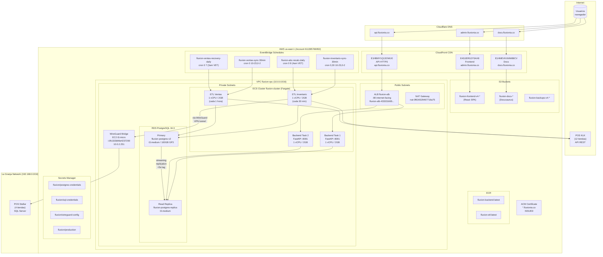
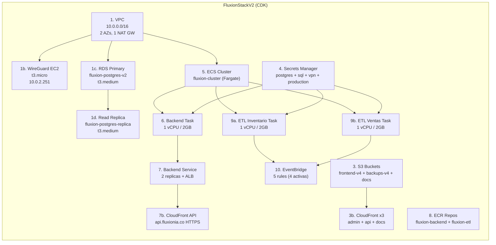
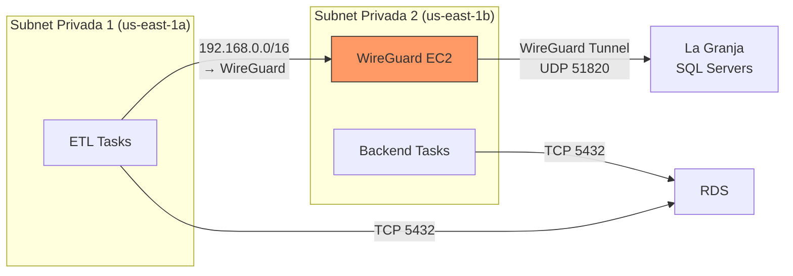
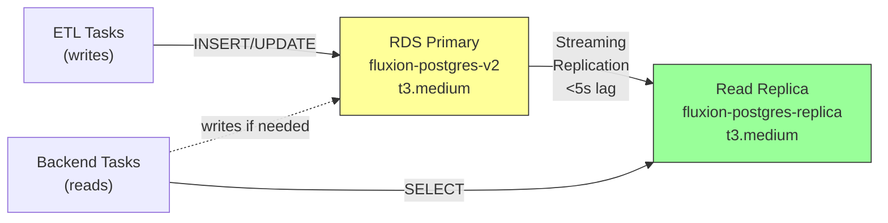
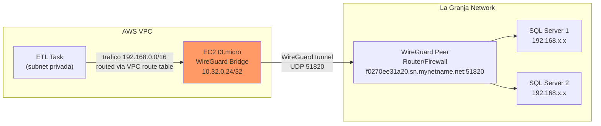
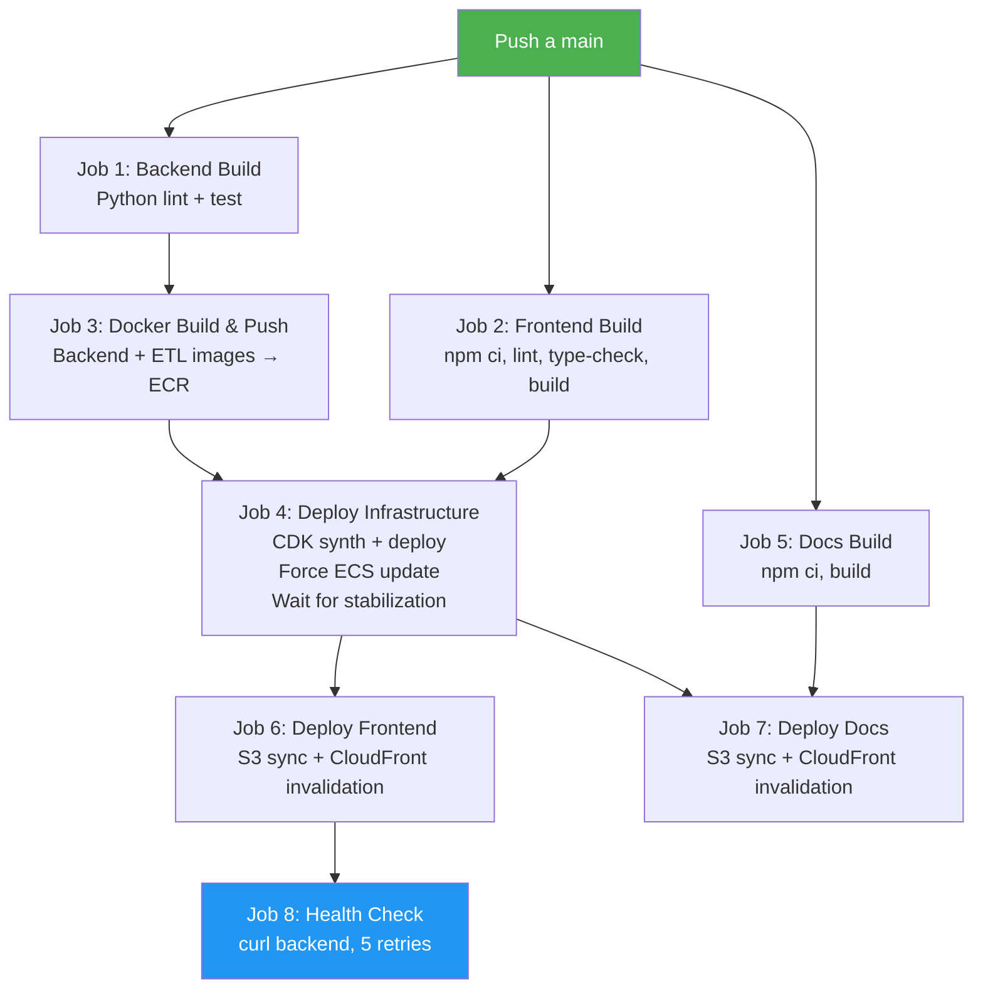

# Arquitectura e Infraestructura - Guia DevOps

> Documentacion tecnica de la infraestructura AWS de Fluxion AI.
> Todo se gestiona via **AWS CDK (TypeScript)** y se despliega con **GitHub Actions**.

---

## Tabla de Contenidos

1. [Diagrama General de Arquitectura](#diagrama-general-de-arquitectura)
2. [Stack de AWS CDK](#stack-de-aws-cdk)
3. [Red y Conectividad (VPC)](#red-y-conectividad-vpc)
4. [Computo (ECS Fargate)](#computo-ecs-fargate)
5. [Base de Datos (RDS PostgreSQL)](#base-de-datos-rds-postgresql)
6. [CDN y Almacenamiento (CloudFront + S3)](#cdn-y-almacenamiento-cloudfront--s3)
7. [VPN Bridge (WireGuard)](#vpn-bridge-wireguard)
8. [Secretos y Configuracion](#secretos-y-configuracion)
9. [CI/CD Pipeline](#cicd-pipeline)
10. [Monitoreo y Observabilidad](#monitoreo-y-observabilidad)
11. [Costos Estimados](#costos-estimados)
12. [Runbooks Operacionales](#runbooks-operacionales)

---

## Diagrama General de Arquitectura

> Verificado contra AWS CLI el 2026-02-09. Refleja recursos realmente desplegados.



## Diagrama del CDK Stack



## Inventario de Recursos AWS (verificado via CLI)

| Recurso | Identificador | Tipo/Spec | Estado |
|---------|--------------|-----------|--------|
| **VPC** | vpc-0612cd85dfc5a044f | 10.0.0.0/16, 2 AZs | active |
| **NAT Gateway** | nat-0f634329467716a75 | Public Subnet 1 | available |
| **EC2 WireGuard** | i-0fc333b96e4237200 | t3.micro, 10.0.2.251 | running |
| **RDS Primary** | fluxion-postgres-v2 | db.t3.medium, PostgreSQL 16.3 | available |
| **RDS Replica** | fluxion-postgres-replica | db.t3.medium, PostgreSQL 16.3 | available |
| **ECS Cluster** | fluxion-cluster | Fargate | active |
| **ECS Service** | fluxion-backend | 2 tasks desired, 2 running | active |
| **ALB** | fluxion-alb | application, internet-facing | active |
| **CloudFront Frontend** | E4DJERG2Y5AX8 | admin.fluxionia.co | Deployed |
| **CloudFront API** | E1HBMY1Q13OWU0 | api.fluxionia.co | Deployed |
| **CloudFront Docs** | E1HMEVKXMW88CV | docs.fluxionia.co | Deployed |
| **S3 Frontend** | fluxion-frontend-v4-611395766952 | React SPA | active |
| **S3 Backups** | fluxion-backups-v4-611395766952 | DB backups | active |
| **S3 Docs** | fluxion-docs-611395766952 | Docusaurus | active |
| **ECR Backend** | fluxion-backend | Docker images | active |
| **ECR ETL** | fluxion-etl | Docker images | active |
| **ACM Certificate** | 88d81742-53fc-... | *.fluxionia.co (wildcard) | ISSUED |

### EventBridge Rules (Scheduling)

| Regla | Cron (UTC) | Hora Venezuela | Estado | Proposito |
|-------|-----------|----------------|--------|-----------|
| `fluxion-inventario-sync-30min` | `0,30 10-23,0-2 * * *` | Cada 30 min, 6am-10pm | ENABLED | Sync inventario todas las tiendas |
| `fluxion-ventas-sync-30min` | `0 10-23,0-2 * * *` | Cada 1 hora, 6am-10pm | ENABLED | Sync ventas PostgreSQL |
| `fluxion-ventas-recovery-daily` | `0 7 * * *` | 3:00 AM VET | ENABLED | Recovery ventas dia anterior |
| `fluxion-abc-recalc-daily` | `0 8 * * *` | 4:00 AM VET | ENABLED | Recalcular clasificacion ABC |
| `fluxion-productos-cache-refresh` | `30 9,15,21,3 * * *` | Cada 6 horas | DISABLED | Refresh cache productos |

### ECS Task Definitions

| Task Definition | Revision Actual | Proposito |
|----------------|----------------|-----------|
| `FluxionBackendTask` | :30 | Backend FastAPI (2 replicas) |
| `FluxionETLTask` | :18 | ETL Inventario (scheduled) |
| `FluxionVentasETLTask` | :12 | ETL Ventas (scheduled) |

### Secrets Manager

| Secreto | Descripcion |
|---------|-------------|
| `fluxion/postgres-credentials` | Credenciales PostgreSQL RDS (auto-generado CDK) |
| `fluxion/sql-credentials` | Credenciales SQL Server La Granja (ETL) |
| `fluxion/wireguard-config` | Config WireGuard (keys, peers, endpoint) |
| `fluxion/production` | Secretos de produccion (SendGrid, emails) |
| `fluxion/db-credentials` | Credenciales DB genéricas (ETL) |

### SSM Parameter Store

| Parametro | Tipo | Proposito |
|-----------|------|-----------|
| `/fluxion/etl/sentry-dsn` | SecureString | DSN de Sentry para ETL monitoring |

### CDK Drift detectado (2026-02-09)

Diferencias entre `infrastructure-stack.ts` y lo realmente desplegado en AWS:

| Recurso | CDK dice | AWS tiene | Tipo de drift |
|---------|----------|-----------|---------------|
| `fluxion-productos-cache-refresh` | `enabled: true` (linea 1228) | **DISABLED** | Manual override via consola/CLI |
| Frontend CloudFront `E4DJERG2Y5AX8` | Sin `domainNames` (linea 349) | Alias `admin.fluxionia.co` | Domain añadido manualmente |
| `FluxionETLTask-test` (rev 1) | No existe en CDK | Existe en AWS | Task definition creada manualmente |

**Accion recomendada:** Sincronizar el CDK con la realidad de AWS para evitar que un `cdk deploy` revierta cambios manuales.

---

## Red y Conectividad (VPC)

### Configuracion de VPC

| Parametro | Valor |
|-----------|-------|
| Nombre | `fluxion-vpc` |
| AZs | 2 (us-east-1a, us-east-1b) |
| Subnets publicas | 2 (CIDR /24) |
| Subnets privadas | 2 (CIDR /24) |
| NAT Gateways | 1 (ahorro de costos) |

### Rutas de Red



**Importante:** Los ETL tasks se lanzan en la **segunda AZ** (us-east-1b) para evitar problemas de routing con WireGuard que esta en la primera AZ.

### Security Groups

| Security Group | Entrada | Salida | Uso |
|---------------|---------|--------|-----|
| ALB SG | 80 (Internet) | 8001 (Backend) | Load Balancer |
| Backend SG | 8001 (ALB) | 5432 (RDS), todo (Internet) | Backend tasks |
| ETL SG | ninguna | 5432 (RDS), todo (VPN, Internet) | ETL tasks |
| WireGuard SG | todo (VPC) | todo | VPN bridge |
| RDS SG | 5432 (Backend, ETL, WG) | ninguna | Base de datos |

---

## Computo (ECS Fargate)

### Cluster

| Parametro | Valor |
|-----------|-------|
| Nombre | `fluxion-cluster` |
| Tipo | Fargate (serverless) |
| Container Insights | Enhanced (v2) |

### Backend Service

| Parametro | Valor |
|-----------|-------|
| Servicio | `fluxion-backend` |
| Tasks deseados | 2 (HA + zero-downtime deploy) |
| CPU por task | 1 vCPU |
| Memoria por task | 2 GB |
| Workers Uvicorn | 2 por task (4 total) |
| Puerto | 8001 |
| ECS Exec | Habilitado (debugging) |
| Health check grace | 120 seg |

**Imagen Docker:** `fluxion-backend:latest` en ECR

**Variables de entorno clave:**
```
ENVIRONMENT=production
POSTGRES_HOST=<read-replica-endpoint>     # Lee del replica
POSTGRES_HOST_PRIMARY=<primary-endpoint>  # Escribe al primary
POSTGRES_PORT=5432
POSTGRES_DB=fluxion_production
UVICORN_WORKERS=2
```

### ETL Tasks (Scheduled)

Hay **3 task definitions** de ETL (2 activas en schedules):

| Task Definition | CPU | Memoria | Schedule | Proposito |
|----------------|-----|---------|----------|-----------|
| `FluxionETLTask` (rev 18) | 1 vCPU | 2 GB | Cada 30 min + diario 4am | Inventario + ABC recalc |
| `FluxionVentasETLTask` (rev 12) | 1 vCPU | 2 GB | Cada 1 hora + diario 3am | Ventas + recovery |
| `FluxionETLTask-test` (rev 1) | 1 vCPU | 2 GB | Manual | Testing |

**Imagen Docker:** `fluxion-etl:latest` en ECR

**Variables de entorno clave:**
```
ENVIRONMENT=production
ETL_MODE=etl_inventario.py         # o etl_ventas_postgres.py
ETL_ARGS=--todas
POSTGRES_HOST=<primary-endpoint>   # Escribe al primary (no replica)
SQL_ODBC_DRIVER=ODBC Driver 17 for SQL Server
VPN_GATEWAY_IP=192.168.20.1
ETL_TIMEOUT=7200                   # 2 horas
```

### Load Balancer (ALB)

| Parametro | Valor |
|-----------|-------|
| Nombre | `fluxion-alb` |
| Tipo | Application (L7) |
| Esquema | Internet-facing |
| Listener | HTTP :80 |
| Idle timeout | 300 seg (5 min, para queries lentas) |
| Health check path | `/` |
| Health check interval | 60 seg |
| Healthy threshold | 2 checks |
| Unhealthy threshold | 5 checks |
| Deregistration delay | 30 seg |

---

## Base de Datos (RDS PostgreSQL)

### Diagrama de Replicacion



### Configuracion Primary

| Parametro | Valor |
|-----------|-------|
| Identificador | `fluxion-postgres-v2` |
| Engine | PostgreSQL 16.3 |
| Instancia | t3.medium (2 vCPU, 4 GB RAM) |
| Storage | 100 GB GP3 (auto-scale hasta 500 GB) |
| IOPS | 3000 (baseline GP3) |
| Encriptado | Si (KMS) |
| Multi-AZ | No (ahorro costos) |
| Backup retention | 7 dias |
| Backup window | 03:00-04:00 UTC (11pm-12am VET) |
| Maintenance window | Domingo 04:00-05:00 UTC |
| Logs exportados | PostgreSQL → CloudWatch |
| Deletion protection | Si |
| Public access | No |

### Parametros Optimizados

```
work_mem = 64MB              # (default 4MB) - evita sorts en disco
maintenance_work_mem = 128MB # para VACUUM, CREATE INDEX
effective_cache_size = 3GB   # estimacion de cache para planner
random_page_cost = 1.1       # optimizado para SSD (default 4.0)
max_parallel_workers = 4     # queries paralelos habilitados
log_min_duration_statement = 1000ms  # log queries > 1 segundo
```

### Parametros Read Replica (adicionales)

```
max_standby_streaming_delay = 900s   # (default 30s) previene "conflict with recovery"
max_standby_archive_delay = 900s
hot_standby_feedback = on            # replica informa al primary sobre queries activos
```

---

## CDN y Almacenamiento (CloudFront + S3)

### Distribuciones CloudFront (verificado)

| ID | Origen | Dominio | Proposito |
|----|--------|---------|-----------|
| `E4DJERG2Y5AX8` | S3 `fluxion-frontend-v4-*` | `admin.fluxionia.co` | SPA React |
| `E1HBMY1Q13OWU0` | ALB `fluxion-alb` | `api.fluxionia.co` | HTTPS termination para API |
| `E1HMEVKXMW88CV` | S3 `fluxion-docs-*` | `docs.fluxionia.co` | Documentacion Docusaurus |

**Certificado SSL:** Wildcard `*.fluxionia.co` via ACM (ARN: `88d81742-53fc-...`).

### S3 Buckets (verificado)

| Bucket | Proposito | Notas |
|--------|-----------|-------|
| `fluxion-frontend-v4-611395766952` | Frontend SPA (React build) | Activo |
| `fluxion-backups-v4-611395766952` | Backups de base de datos | Activo |
| `fluxion-docs-611395766952` | Sitio de documentacion | Activo |
| `fluxion-backups-611395766952` | Backups legacy v1 | Legacy |
| `fluxion-backups-v2-611395766952` | Backups legacy v2 | Legacy |
| `fluxion-backups-v3-611395766952` | Backups legacy v3 | Legacy |

### Frontend CDN Config

- Origin Access Control (OAC) para S3
- HTTPS redirect
- Compresion habilitada
- SPA routing: errores 403/404 → `/index.html` (para React Router)

### Backend CDN Config

- Cache **deshabilitado** (CachingDisabled policy)
- Forward all headers, query strings, cookies
- HTTPS → HTTP (ALB no tiene HTTPS)
- Read timeout: 60 seg

---

## VPN Bridge (WireGuard)

### Diagrama de Conectividad VPN



### Configuracion

| Parametro | Valor |
|-----------|-------|
| Instancia | EC2 t3.micro |
| Subnet | Private (PRIVATE_WITH_EGRESS) |
| Source/Dest Check | Deshabilitado (requerido para NAT) |
| IP interna WireGuard | 10.32.0.24/32 |
| Redes alcanzables | 192.168.0.0/16 |
| Peer endpoint | f0270ee31a20.sn.mynetname.net:51820 |
| Keepalive | 25 seg |

### Routing

La tabla de rutas de las subnets privadas tiene una entrada:
```
192.168.0.0/16 → WireGuard EC2 instance
```

Esto permite que los ETL tasks alcancen los SQL Servers de La Granja sin configuracion adicional.

### iptables en WireGuard EC2

```bash
iptables -t nat -A POSTROUTING -o wg0 -j MASQUERADE          # NAT para trafico saliente
iptables -A FORWARD -i ens5 -o wg0 -j ACCEPT                  # Forward VPC → WireGuard
iptables -A FORWARD -i wg0 -o ens5 -m state --state RELATED,ESTABLISHED -j ACCEPT
```

---

## Secretos y Configuracion

> Los secretos de Secrets Manager y SSM están detallados en la tabla de inventario arriba.

### GitHub Secrets (CI/CD)

| Secret | Proposito |
|--------|-----------|
| `AWS_ACCESS_KEY_ID` | Credenciales IAM para deploy |
| `AWS_SECRET_ACCESS_KEY` | Credenciales IAM para deploy |
| `AWS_ACCOUNT_ID` | `611395766952` |

---

## CI/CD Pipeline

### Diagrama del Pipeline



### Jobs del Pipeline (`deploy.yml`)

| Job | Dependencias | Que hace |
|-----|-------------|----------|
| **1. backend-build** | ninguna | Python 3.11 setup, pip install, flake8 lint, pytest |
| **2. frontend-build** | ninguna | Node 20, npm ci, ESLint, type-check, Vite build |
| **3. backend-docker** | job 1 | Build y push de imagenes Docker (backend + ETL) a ECR |
| **4. deploy-infrastructure** | jobs 2, 3 | CDK bootstrap, synth, deploy. Force ECS update. Wait for stabilization |
| **5. docs-build** | ninguna | Build sitio de documentacion |
| **6. deploy-frontend** | job 4 | S3 sync + CloudFront invalidation |
| **7. deploy-docs** | jobs 4, 5 | S3 sync + CloudFront invalidation |
| **8. health-check** | jobs 4, 6 | curl al backend (5 retries, 10 seg entre cada uno) |

### Trigger

- **Automatico:** Push a `main`
- **Manual:** `workflow_dispatch` desde GitHub UI

### ECR Repositories

| Repositorio | Imagen | Dockerfile |
|-------------|--------|------------|
| `fluxion-backend` | Python 3.11 + FastAPI + psycopg2 | `backend/Dockerfile` |
| `fluxion-etl` | Python 3.11 + SQL Server drivers + AWS CLI | `etl/Dockerfile` |

---

## Monitoreo y Observabilidad

### Logging

| Componente | Destino | Retencion |
|-----------|---------|-----------|
| Backend | CloudWatch `/ecs/fluxion-backend` | 7 dias |
| ETL | CloudWatch `/ecs/fluxion-etl` | 7 dias |
| PostgreSQL | CloudWatch (postgresql logs) | 7 dias |

### Sentry

| Componente | Proyecto Sentry |
|-----------|----------------|
| Backend | `fluxion-backend` (via `sentry_config.py`) |
| Frontend | `fluxion-frontend` (via `@sentry/react`) |
| ETL | `etl-process` (cron monitors) |

### Metricas

- **Container Insights Enhanced** habilitado en ECS
- **Queries lentas** logueadas automaticamente (> 1 segundo)
- **ETL health check:** Flag file `/app/logs/etl_last_success.flag`

### Comandos Utiles de Monitoreo

```bash
# Ver logs del backend en tiempo real
aws logs tail /ecs/fluxion-backend --follow --region us-east-1

# Ver logs del ETL
aws logs tail /ecs/fluxion-etl --follow --region us-east-1

# Ver status de los servicios ECS
aws ecs describe-services --cluster fluxion-cluster --services fluxion-backend --query 'services[0].{desired:desiredCount,running:runningCount,pending:pendingCount}'

# Conectarse a un container del backend (ECS Exec)
aws ecs execute-command --cluster fluxion-cluster --task <TASK_ID> --container backend --interactive --command "/bin/bash"

# Ver estado del RDS
aws rds describe-db-instances --db-instance-identifier fluxion-postgres-v2 --query 'DBInstances[0].{status:DBInstanceStatus,storage:AllocatedStorage,cpu:DBInstanceClass}'

# Ver tareas ETL recientes
aws ecs list-tasks --cluster fluxion-cluster --family FluxionETLTask --desired-status STOPPED --query 'taskArns[0:5]'

# Ver regla de EventBridge
aws events describe-rule --name fluxion-inventario-sync-30min
```

---

## Costos Estimados

| Recurso | Especificacion | Costo Mensual Aprox. |
|---------|---------------|---------------------|
| ECS Fargate Backend | 2 tasks x 1 vCPU x 2 GB x 24/7 | ~$60 |
| ECS Fargate ETL | 1 task x 1 vCPU x 2 GB x ~34 runs/dia x ~10 min | ~$15 |
| RDS Primary | t3.medium, 100 GB GP3 | ~$50 |
| RDS Read Replica | t3.medium | ~$45 |
| NAT Gateway | 1 x 24/7 + data transfer | ~$35 |
| ALB | 1 x 24/7 | ~$20 |
| CloudFront | 3 distribuciones (bajo trafico) | ~$5 |
| S3 | Frontend + Backups | ~$3 |
| EC2 WireGuard | t3.micro | ~$8 |
| Secrets Manager | ~5 secretos | ~$3 |
| CloudWatch Logs | ~5 GB/mes | ~$3 |
| **Total estimado** | | **~$250/mes** |

---

## Runbooks Operacionales

### Deploy manual (sin CI/CD)

```bash
# 1. Build y push Docker images
cd backend
docker build --platform linux/amd64 -f Dockerfile -t <ECR_REGISTRY>/fluxion-backend:latest ..
docker push <ECR_REGISTRY>/fluxion-backend:latest

cd ../etl
docker build --platform linux/amd64 -t <ECR_REGISTRY>/fluxion-etl:latest .
docker push <ECR_REGISTRY>/fluxion-etl:latest

# 2. Force new deployment
aws ecs update-service --cluster fluxion-cluster --service fluxion-backend --force-new-deployment

# 3. Wait for stabilization
aws ecs wait services-stable --cluster fluxion-cluster --services fluxion-backend
```

### Ejecutar ETL manualmente

```bash
aws ecs run-task \
  --cluster fluxion-cluster \
  --task-definition FluxionETLTask \
  --launch-type FARGATE \
  --network-configuration "awsvpcConfiguration={subnets=[<SUBNET_ID>],securityGroups=[<SG_ID>],assignPublicIp=DISABLED}" \
  --overrides '{
    "containerOverrides": [{
      "name": "etl",
      "command": ["python", "etl_inventario.py", "--todas"]
    }]
  }'
```

### Rollback del Backend

```bash
# 1. Ver imagenes disponibles en ECR
aws ecr list-images --repository-name fluxion-backend --query 'imageIds[*].imageTag'

# 2. Re-tag la imagen anterior como latest
# (o usar la imagen anterior con tag especifico en el task definition)

# 3. Force new deployment
aws ecs update-service --cluster fluxion-cluster --service fluxion-backend --force-new-deployment
```

### Escalar el Backend

```bash
# Escalar a 3 tasks (temporalmente)
aws ecs update-service --cluster fluxion-cluster --service fluxion-backend --desired-count 3

# Volver a 2 tasks
aws ecs update-service --cluster fluxion-cluster --service fluxion-backend --desired-count 2
```

### Reiniciar WireGuard VPN

```bash
# Conectar via SSM
aws ssm start-session --target <INSTANCE_ID>

# Reiniciar WireGuard
sudo systemctl restart wg-quick@wg0

# Verificar estado
sudo wg show
ping 192.168.20.1  # Gateway La Granja
```

### Backup manual de PostgreSQL

```bash
# Crear snapshot manual
aws rds create-db-snapshot \
  --db-instance-identifier fluxion-postgres-v2 \
  --db-snapshot-identifier manual-backup-$(date +%Y%m%d)
```

### Conectarse a PostgreSQL desde ECS

```bash
# Usar ECS Exec en un container del backend
aws ecs execute-command \
  --cluster fluxion-cluster \
  --task <TASK_ID> \
  --container backend \
  --interactive \
  --command "python3 -c \"from database import get_connection; c=get_connection(); print('Connected!'); c.close()\""
```
