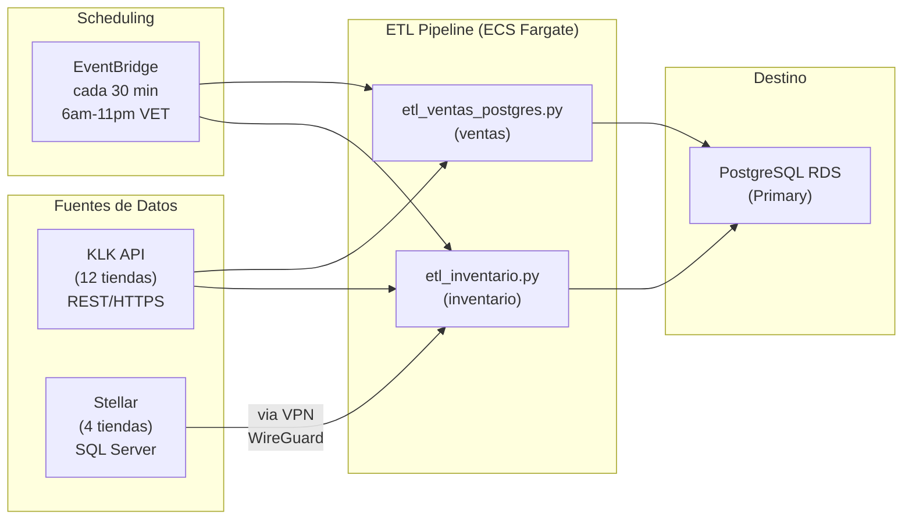
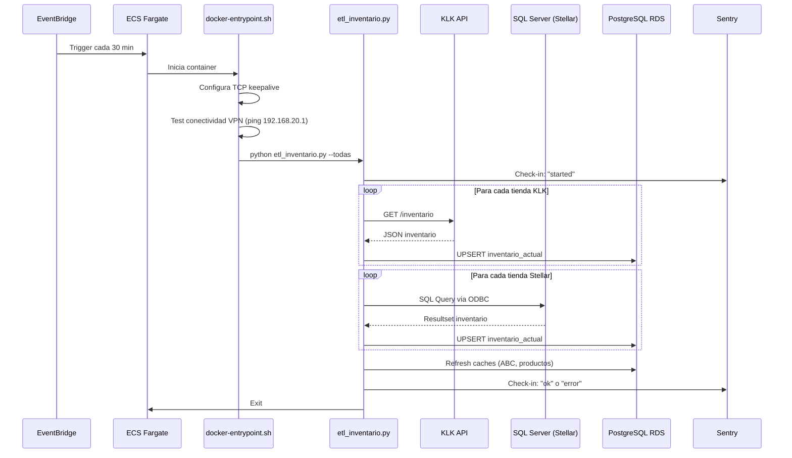

# Pipeline ETL - Documentacion Tecnica

> El ETL extrae datos de los sistemas POS de La Granja cada 30 minutos y los carga en PostgreSQL RDS.

---

## Tabla de Contenidos

1. [Vision General](#vision-general)
2. [Arquitectura del Pipeline](#arquitectura-del-pipeline)
3. [Scripts ETL](#scripts-etl)
4. [Fuentes de Datos](#fuentes-de-datos)
5. [Configuracion de Tiendas](#configuracion-de-tiendas)
6. [Flujo de Ejecucion](#flujo-de-ejecucion)
7. [Conectividad y VPN](#conectividad-y-vpn)
8. [Monitoreo (Sentry)](#monitoreo-sentry)
9. [Ejecucion Manual](#ejecucion-manual)
10. [Troubleshooting](#troubleshooting)

---

## Vision General



### Horarios de Ejecucion (EventBridge - verificado via AWS CLI)

| Regla | Frecuencia | Horario VET | Estado | Script |
|-------|-----------|-------------|--------|--------|
| `fluxion-inventario-sync-30min` | Cada 30 min | 6am-10pm | ENABLED | `etl_inventario.py --todas` |
| `fluxion-ventas-sync-30min` | Cada 1 hora | 6am-10pm | ENABLED | `etl_ventas_postgres.py` |
| `fluxion-ventas-recovery-daily` | Diario 3:00 AM | 3am | ENABLED | Reprocesa ventas dia anterior |
| `fluxion-abc-recalc-daily` | Diario 4:00 AM | 4am | ENABLED | Recalcula clasificacion ABC |
| `fluxion-productos-cache-refresh` | Cada 6 horas | -- | DISABLED | Refresh cache productos |

---

## Arquitectura del Pipeline

```
etl/
├── etl_inventario.py              # ETL principal: inventario de todas las tiendas
├── etl_ventas_postgres.py         # ETL de ventas (KLK → PostgreSQL)
├── etl_ventas_multi_tienda.py     # ETL de ventas multi-tienda
├── etl_inventario_klk_postgres.py # ETL inventario KLK directo a PostgreSQL
├── refresh_productos_cache.py     # Refresca cache ABC de productos
├── recalcular_abc_cache.py        # Recalcula clasificaciones ABC
├── monitor_phantom_zeros.py       # Detecta inventarios fantasma (cantidades 0)
├── etl_notifier.py                # Sistema de notificaciones ETL
├── email_notifier.py              # Envio de emails (SendGrid)
│
├── core/                          # Modulos compartidos
│   ├── tiendas_config.py          # Config de 20 ubicaciones (IPs, puertos, credenciales)
│   ├── extractor_inventario.py    # Extractor generico de inventarios
│   ├── extractor_ventas.py        # Extractor de ventas desde KLK
│   ├── query_inventario_generic.sql # Query SQL para Stellar (inventario)
│   └── [otros modulos]
│
├── scripts/                       # Scripts auxiliares
├── Dockerfile                     # Imagen con SQL Server drivers
├── docker-entrypoint.sh           # Configura TCP keepalive
├── startup-etl.sh                 # Script de arranque en produccion
└── requirements.txt               # Dependencias Python
```

---

## Scripts ETL

### `etl_inventario.py` (Principal)

El script mas importante. Extrae el inventario actual de **todas las tiendas** y lo carga en la tabla `inventario_actual`.

```bash
# Ejecutar todas las tiendas activas
python etl_inventario.py --todas

# Ejecutar una tienda especifica
python etl_inventario.py --tienda tienda_01
```

**Flujo:**
1. Lee la configuracion de tiendas desde `tiendas_config.py`
2. Para cada tienda activa:
   - **KLK:** Llama al API REST para obtener inventario
   - **Stellar:** Conecta via SQL Server (ODBC) y ejecuta `query_inventario_generic.sql`
3. Transforma datos al formato unificado
4. Carga (UPSERT) en la tabla `inventario_actual`
5. Opcionalmente guarda snapshot en `inventario_historico`
6. Refresca caches (ABC, productos)

### `etl_ventas_postgres.py`

Extrae ventas del dia desde KLK y las carga incrementalmente en PostgreSQL.

**Flujo:**
1. Consulta la API KLK para ventas del dia
2. Compara con lo ya cargado (evita duplicados)
3. Inserta nuevas ventas en la tabla `ventas`

### `refresh_productos_cache.py`

Recalcula la clasificacion ABC de productos y actualiza la tabla `productos_abc_cache`.

### `monitor_phantom_zeros.py`

Detecta productos con inventario 0 que probablemente son errores del POS (inventarios "fantasma"). Genera alertas.

### `email_notifier.py`

Envia notificaciones por email via SendGrid cuando hay eventos criticos:
- ETL fallidos
- Agotamientos masivos
- Errores de conectividad

---

## Fuentes de Datos

### KLK API (12 Tiendas)

| Parametro | Valor |
|-----------|-------|
| Protocolo | REST API (HTTPS) |
| Autenticacion | API Key en header |
| Tiendas | 12 tiendas retail |
| Datos | Inventario + Ventas |
| Conectividad | Directa (Internet) |

### Stellar SQL Server (4 Tiendas)

| Parametro | Valor |
|-----------|-------|
| Protocolo | SQL Server (TDS) via ODBC |
| Driver | ODBC Driver 17 for SQL Server |
| Tiendas | CEDI Frio, CEDI Seco, CEDI Verde, y otros |
| Datos | Solo inventario |
| Conectividad | VPN WireGuard (192.168.x.x) |
| Query | `core/query_inventario_generic.sql` |

### Query Stellar (Inventario)

El query `query_inventario_generic.sql` extrae inventario completo de la base de datos VAD10:
- Joins 6+ tablas maestras (productos, codigos, departamentos, grupos, subgrupos, depositos)
- Filtra por deposito/almacen especifico (`{codigo_deposito}`)
- Excluye departamento PROCURA (codigo 000017)
- Solo productos activos con codigo de barras tipo BARRA

---

## Configuracion de Tiendas

La configuracion de todas las tiendas esta en `etl/core/tiendas_config.py`.

### Estructura de cada tienda

```python
@dataclass
class TiendaConfig:
    id: str                    # Identificador unico (ej: "tienda_01")
    nombre: str                # Nombre legible
    tipo: str                  # "klk" o "stellar"
    activo: bool               # Si se procesa o no
    server: str                # IP o hostname del POS
    port: int                  # Puerto de conexion
    database: str              # Base de datos
    deposito: str              # Codigo de deposito/almacen
    ubicacion_id: str          # ID en tabla ubicaciones de PostgreSQL
    # ... otros campos
```

### Entorno Local vs Produccion

El archivo maneja IPs diferentes segun el entorno:

```python
get_server_ip(
    local_ip="192.168.1.100",      # IP directa para desarrollo local
    prod_ip="192.168.20.100"       # IP via WireGuard VPN para produccion
)
```

La variable `ETL_ENVIRONMENT` controla cual IP se usa:
- `local` (default): IPs directas (desarrollo)
- `production`: IPs via VPN (AWS)

---

## Flujo de Ejecucion

### En Produccion (AWS)



### Docker Entrypoint

El `docker-entrypoint.sh` ejecuta antes del ETL y:
1. Configura TCP keepalive del kernel (para conexiones VPN largas)
2. Verifica conectividad al gateway VPN (ping 192.168.20.1)
3. Ejecuta el script ETL pasado como argumento

---

## Conectividad y VPN

### Como el ETL alcanza los SQL Servers de La Granja

1. El task ETL se ejecuta en una subnet privada de la VPC
2. Cuando intenta conectar a `192.168.x.x`, la tabla de rutas de la VPC envia el trafico al EC2 WireGuard
3. El EC2 WireGuard hace NAT (MASQUERADE) y reenvia el trafico por el tunel WireGuard
4. El trafico llega al peer WireGuard en la red de La Granja
5. El peer enruta el trafico al SQL Server correspondiente

**No se necesita configuracion especial en el ETL** - el routing de la VPC es transparente.

### TCP Keepalive

Las conexiones SQL Server via VPN son propensas a timeouts. El `docker-entrypoint.sh` configura:

```bash
# Enviar keepalive cada 30 segundos (default 7200 = 2 horas)
sysctl -w net.ipv4.tcp_keepalive_time=30
sysctl -w net.ipv4.tcp_keepalive_intvl=10
sysctl -w net.ipv4.tcp_keepalive_probes=5
```

---

## Monitoreo (Sentry)

El ETL usa **Sentry Cron Monitors** para rastrear ejecuciones:

```python
import sentry_sdk
from sentry_sdk.crons import capture_checkin

# Al iniciar
check_in_id = capture_checkin(monitor_slug="etl-inventario", status="in_progress")

# Al terminar exitosamente
capture_checkin(monitor_slug="etl-inventario", check_in_id=check_in_id, status="ok")

# Al fallar
capture_checkin(monitor_slug="etl-inventario", check_in_id=check_in_id, status="error")
```

Sentry alerta automaticamente si:
- Un ETL falla
- Un ETL no se ejecuta en el intervalo esperado (missed check-in)
- Un ETL excede el tiempo maximo

---

## Ejecucion Manual

### Desarrollo Local

```bash
cd etl

# Activar virtual env
python3 -m venv venv
source venv/bin/activate
pip install -r requirements.txt

# Configurar .env
cp .env.example .env
# Editar .env con credenciales locales

# Ejecutar inventario (todas las tiendas)
python etl_inventario.py --todas

# Ejecutar una sola tienda
python etl_inventario.py --tienda tienda_01

# Ejecutar ventas
python etl_ventas_postgres.py
```

### Produccion (AWS)

```bash
# Via AWS CLI (lanza un ECS task)
aws ecs run-task \
  --cluster fluxion-cluster \
  --task-definition FluxionETLTask \
  --launch-type FARGATE \
  --network-configuration "awsvpcConfiguration={subnets=[<SUBNET>],securityGroups=[<SG>],assignPublicIp=DISABLED}" \
  --overrides '{
    "containerOverrides": [{
      "name": "etl",
      "command": ["python", "etl_inventario.py", "--todas"]
    }]
  }'
```

### Via Backend API

El backend tiene un endpoint para lanzar ETL manualmente:
```
POST /etl/sync
```
Esto usa `boto3` para lanzar un ECS task con la misma configuracion que EventBridge.

---

## Troubleshooting

### ETL no puede conectar a SQL Server (Stellar)

```bash
# 1. Verificar VPN
aws ssm start-session --target <WIREGUARD_INSTANCE_ID>
sudo wg show  # Debe mostrar handshake reciente
ping 192.168.20.1  # Gateway La Granja

# 2. Verificar que el ETL esta en la subnet correcta (us-east-1b)
aws ecs describe-tasks --cluster fluxion-cluster --tasks <TASK_ARN> \
  --query 'tasks[0].attachments[0].details'

# 3. Verificar logs del ETL
aws logs tail /ecs/fluxion-etl --follow
```

### ETL falla con timeout de SQL Server

Posibles causas:
- VPN inestable: Verificar WireGuard (`sudo wg show`)
- TCP keepalive no configurado: Verificar `docker-entrypoint.sh`
- SQL Server caido: Verificar con el equipo de La Granja

### ETL duplica datos

El ETL usa UPSERT (`INSERT ... ON CONFLICT UPDATE`) para inventario, asi que no deberia duplicar. Para ventas, verifica la logica de deduplicacion en `etl_ventas_postgres.py`.

### Sentry no reporta ejecuciones

1. Verificar que `SENTRY_DSN` esta configurado en SSM Parameter Store
2. Verificar que el ETL task tiene permiso para leer el parametro
3. Verificar en Sentry que el monitor slug coincide
